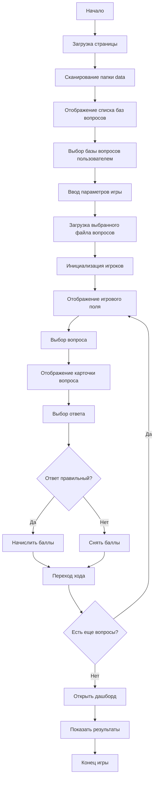

# Архитектура приложения "Своя Игра"

## Общее описание
Веб-приложение для проведения игры "Своя Игра" в браузере без необходимости установки дополнительных программ. Все зависимости размещены локально.

## Требования
1. Участие от 2 до 6 игроков (задается при старте игры)
2. Выбор базы вопросов из доступных файлов в папке data при старте игры
3. Возможность загрузки базы вопросов из файла пользователя с локального компьютера через браузер
4. Файл конфигурации (questions.json) содержит список доступных баз вопросов
5. Вопросы в текстовом файле (формат JSON)
    - Поле "subject" с наименованием предмета/темы
    - От 2 до 4 вариантов ответа
    - Указание правильного ответа
    - Количество баллов за вопрос
    - Возможность прикрепления картинки к вопросу
    - Группировка по категории и стоимости вопроса
6. Отображение наименования предмета в заголовке страницы во время игры
7. Дашборд с итогами текущего раунда
8. Отдельные файлы стилей для оформления

## Архитектура приложения

### Файловая структура
```
my_game/
├── index.html          # Главная страница приложения
├── game.html           # Страница игры
├── dashboard.html       # Дашборд с результатами
├── css/
│   ├── main.css        # Основные стили
│   ├── game.css        # Стили для страницы игры
│   └── dashboard.css   # Стили для дашборда
├── js/
│   ├── game.js         # Логика игры
│   ├── ui.js           # Управление интерфейсом
│   └── data.js         # Работа с данными
├── data/
│   ├── questions.json  # Конфигурация с списком баз вопросов
│   ├── history1.json   # Вопросы по истории
│   ├── math1.json      # Вопросы по математике
│   └── [другие файлы вопросов]
├── images/
│   └── [картинки для вопросов]
└── README.md           # Документация
```

### Структура данных

#### Конфигурация баз вопросов (questions.json)
```json
{
  "bases": [
    {
      "file": "history1.json",
      "name": "История"
    },
    {
      "file": "math1.json",
      "name": "Математика"
    }
  ]
}
```

#### Файл с вопросами (history1.json, math1.json и др.)
```json
{
  "subject": "Название предмета или темы",
  "categories": [
    {
      "id": 1,
      "name": "Категория 1",
      "questions": [
        {
          "id": 1,
          "text": "Текст вопроса",
          "options": ["Вариант 1", "Вариант 2", "Вариант 3", "Вариант 4"],
          "correctAnswer": 0,
          "points": 100,
          "image": "images/question1.jpg" // опционально
        }
      ]
    }
  ]
}
```

#### Состояние игры
```javascript
{
  "players": [
    {"id": 1, "name": "Игрок 1", "score": 0},
    {"id": 2, "name": "Игрок 2", "score": 0}
  ],
  "currentPlayer": 0,
  "currentQuestion": null,
  "answeredQuestions": [],
  "gameStatus": "setup" // setup, playing, finished
}
```

## Компоненты приложения

### 1. Стартовый экран (index.html)
- Загрузка файла конфигурации questions.json для получения списка баз вопросов
- Отображение списка доступных баз вопросов
- Возможность выбора базы вопросов пользователем
- Ввод количества игроков (от 2 до 6)
- Ввод имен игроков
- Кнопка начала игры

### 2. Игровое поле (game.html)
- Отображение заголовка с наименованием предмета (из поля "subject" в JSON)
- Отображение категорий и вопросов
- Выбор вопроса
- Отображение карточки вопроса с вариантами ответов
- Возможность выбора ответа
- Начисление/снятие баллов
- Переход хода

### 3. Дашборд (dashboard.html)
- Таблица результатов игроков
- Статистика по отвеченным вопросам
- Кнопка завершения игры

### 4. Общие элементы
- Шапка с названием игры, организации с логотипом и предметом (из JSON)
- Подвал с информацией о разработчике
- Дизайн совменный и лаконичный для всех страниц

## Технологии
- HTML5 для разметки страницы
- Tailwind CSS для стилей
- JavaScript (ES6+) для логики
- Локальное хранение данных (localStorage)
- Все зависимости локально (без CDN)
- Запуск приложения - локально в браузере без выделенного сервера (возможны проблемы с CORS)

## Поток управления



## Особенности реализации

1. Все зависимости локально:
   - Используем только нативный JavaScript
   - Все стили в отдельных CSS файлах
   - Изображения в локальной папке

2. Хранение данных:
   - questions.json - конфигурация со списком баз вопросов
   - Файлы вопросов в формате JSON с полем "subject"
   - Добавление новой базы вопросов: создать файл и добавить запись в questions.json
   - Состояние игры в localStorage

3. Адаптивность:
   - Поддержка разных размеров экранов
   - Удобное отображение на проекторе/ТВ

4. Управление:
   - Интуитивный интерфейс
   - Четкая индикация текущего игрока
   - Визуальное выделение выбранного вопроса